# Build & Deploy a Static Dashboard​

See gitlab pages deployment: https://dashboard-starter-with-examples-8c1afe.pages.oit.duke.edu/ 

## Create a dashboard
```
Create a static dashboard website using plain HTML, CSS, and JavaScript that loads data directly at runtime from dashboard_data/digital_material_type_shares_by_year.csv, do not embed it; use Plotly.js to render exactly one interactive chart and one clearly written interesting finding derived from the CSV data, make the page responsive and visually polished.
```

### Try a new chart
Prompt:
```
Change to a stacked bar chart in Plotly.js
```

### Try a new library
- Plotly.js [(link)​](https://plotly.com/javascript/)
- Apache Echarts [(link)​](https://echarts.apache.org/examples/en/index.html#chart-type-bar)
- Map: Leaflet [(link)](https://leafletjs.com/examples.html)
Prompt:
```
Change to Apache Echarts
```

### Try the bar race chart
Prompt:
```
Change to a bar race chart
```

## Create a Table
```
Create a table below the chart showing the most popular material type of each year using AG Grid Community 32
```

## Create a new data viz
```
Create a new data visualization that loads data directly at runtime from dashboard_data/digital_top_sampled_titles_by_year.csv, do not embed it; render exactly one interactive chart and one clearly written interesting finding derived from the CSV data. Adds it below the exisitng ones.
```

## Create a sub-agent
```
Create a repo-local subagent definition for CSV data visualization work, saved under agents/. The subagent should accept a CSV path and output location, inspect the CSV schema first, build a static responsive HTML/CSS/JS visualization, load the CSV directly at runtime with fetch() and never embed data or derived full datasets, use a browser visualization library such as Plotly.js, Apache ECharts, AG Grid Community 32 for tables, or Leaflet for map-style views, render exactly one interactive chart or requested table, compute exactly one clear finding from the runtime-loaded CSV, keep edits scoped to the requested output files, and verify syntax plus confirm the CSV is referenced rather than embedded.
```

## Use Data Viz Accessibility Skill
```
use $data-viz-accessibility to audit the dashboard
```

## Deploy on Gitlab Pages

### Set up SSH key
Ensure you have an ssh key added to your Duke OIT GitLab account inside https://gitlab.oit.duke.edu/. If you already have one, great! If not, do the following:
 
1. Generate an ssh public/private key-pair on your laptop as explained here: https://gitlab.oit.duke.edu/help/user/ssh.md#generate-an-ssh-key-pair
 
2. Upload the PUBLIC half of that key-pair to Duke OIT Gitlab as explained here:  https://gitlab.oit.duke.edu/help/user/ssh.md#add-an-ssh-key-to-your-gitlab-account
 
To check if you have set up your ssh key successfully, use the following command in your terminal:
 
   ssh -T git@gitlab.oit.duke.edu
   
You should see the following message, with your NetID filled in for NETID:
 
  Welcome to GitLab, @NETID! 

### Set up the repo
1. Move index.html, index.css, dashboard_data/ into a public/ folder
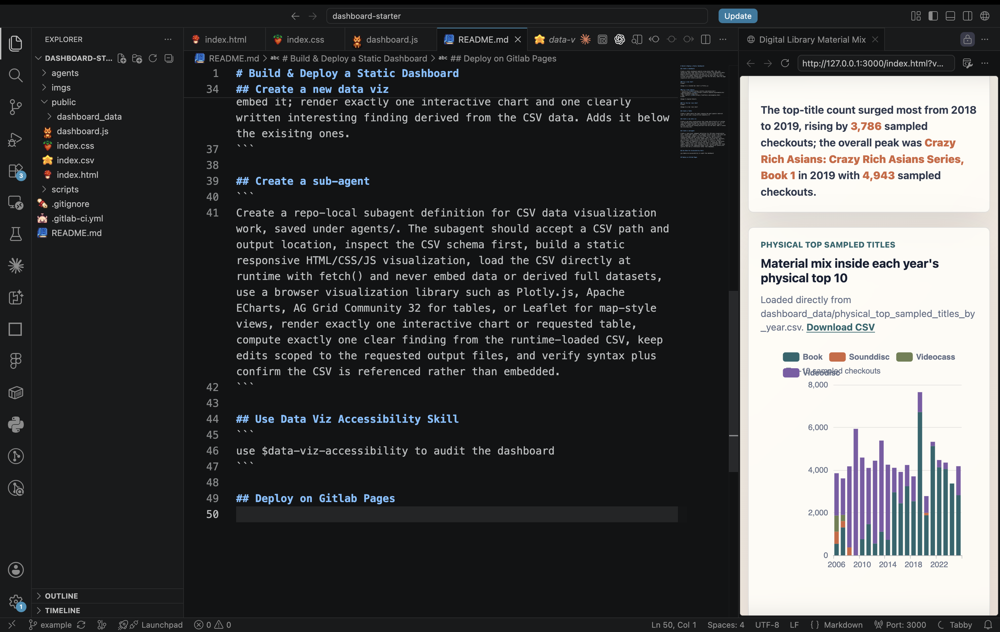

2. Create a new empty repo
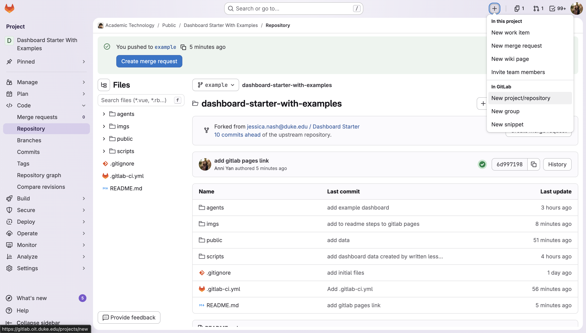

3. Fill in the form. Make sure the README.md option is **NOT** selected
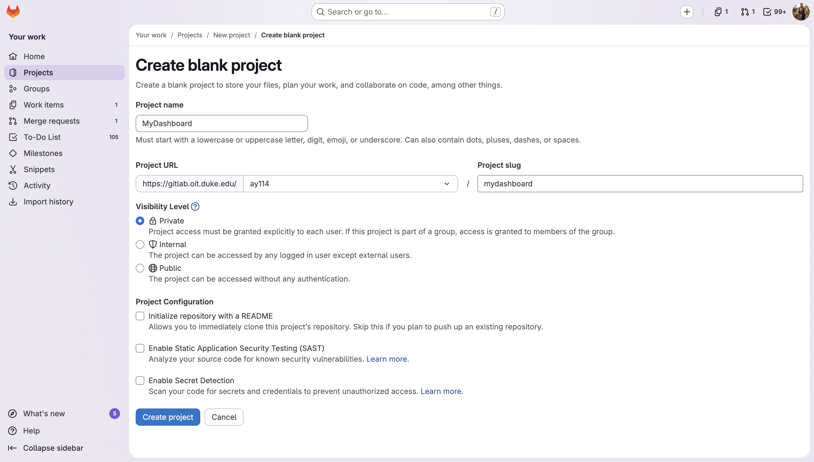

4. Add a new origin
```bash
git init --initial-branch=main
git remote add origin2 git@gitlab.oit.duke.edu:ay114/mydashboard.git
git add .
git commit -m "Initial commit"
git push --set-upstream origin2 main
```
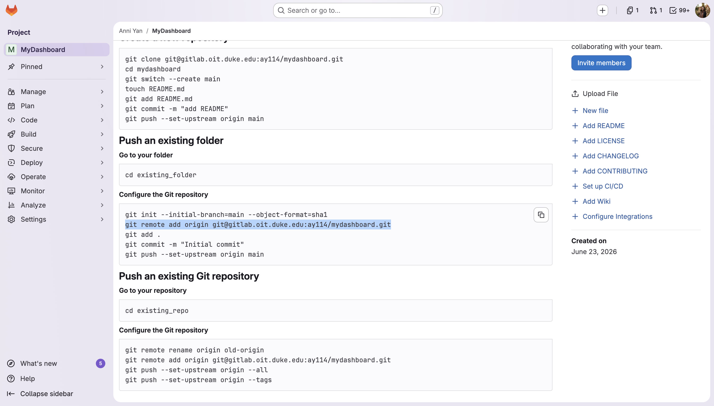

5. Refresh the git repo and you'll see your code

### Set up Gitlab

1. Visit Settings -> General -> Visibility
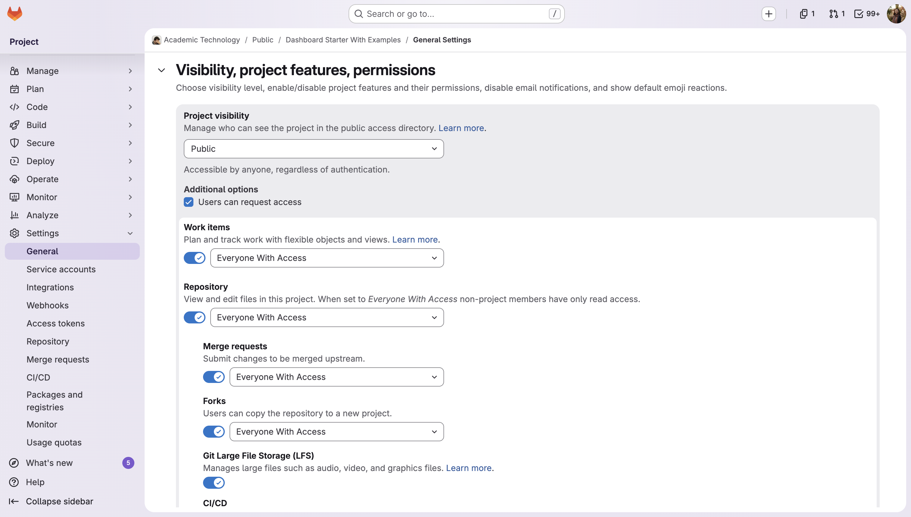

2. Make sure the Gitlab Pages setting is on
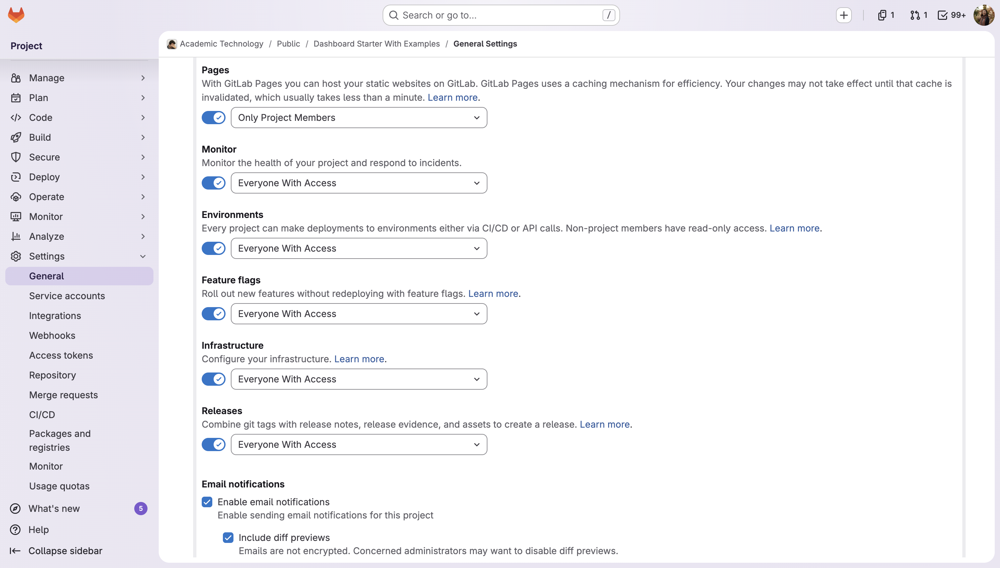

3. Go to Deploy -> Pages, create a runner. Copy and paste the following setting
```
image: alpine:latest

pages:
  stage: deploy
  script:
    - echo "Deploying static assets..."
  artifacts:
    paths:
      - public
  rules:
    - if: '$CI_COMMIT_BRANCH == "main"'

```
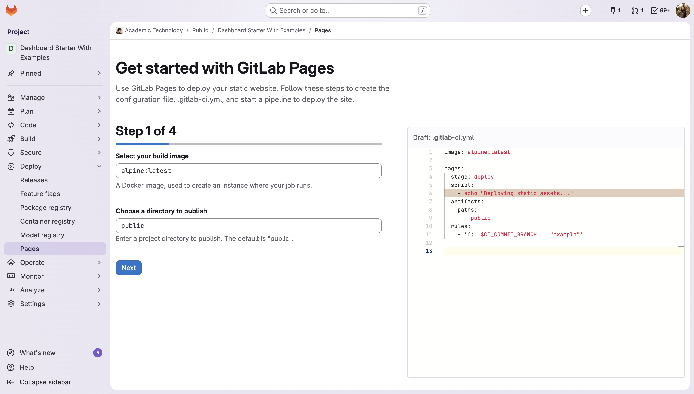

4. Press commit. This step will generate a `.gitlab-ci.yml` file.
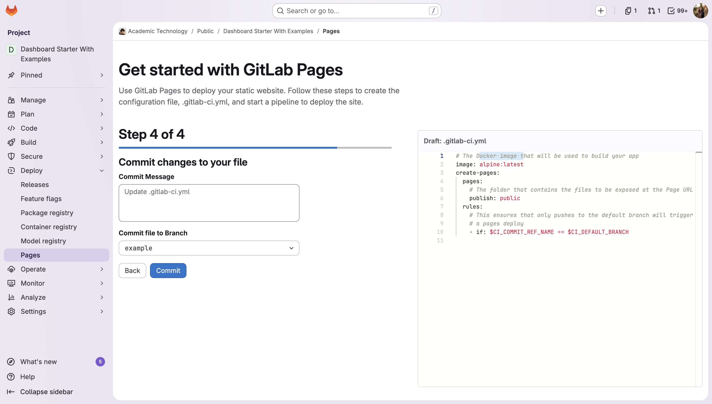

5. Check pipeline
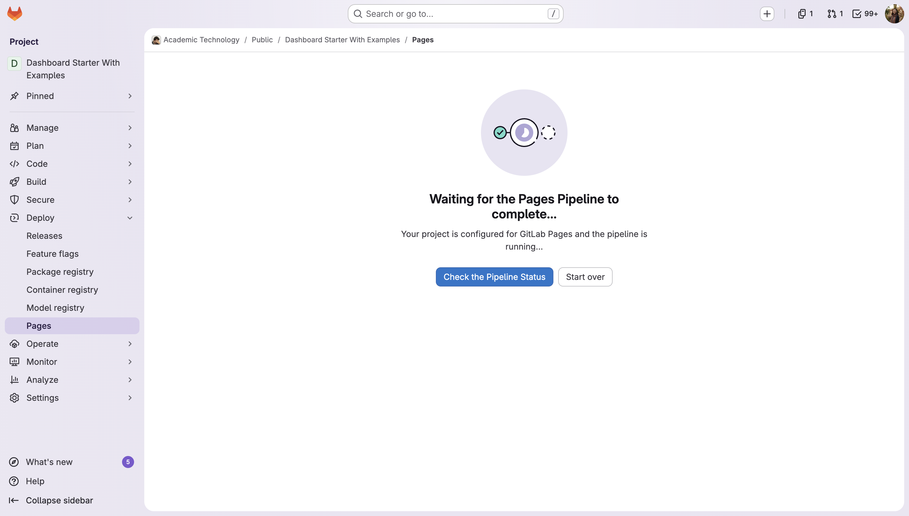

6. View the pipeline and see it runs
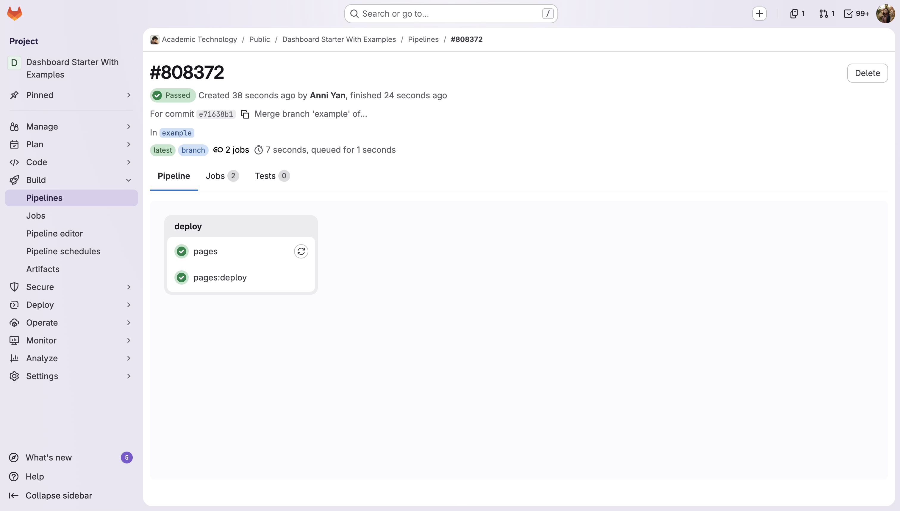

7. When the pipeline succeeds, you'll be able to visit a link
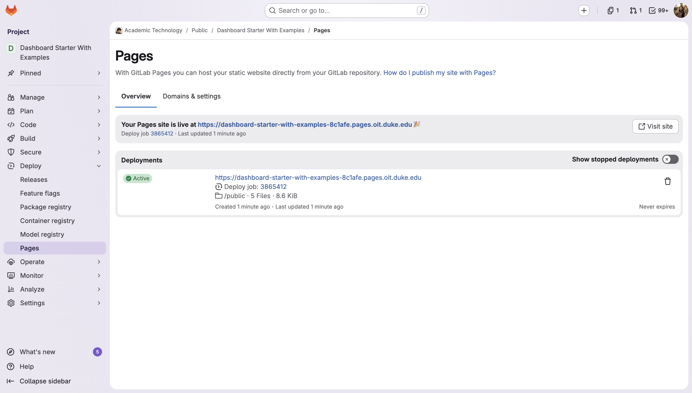

8. See the dashboard deployed!
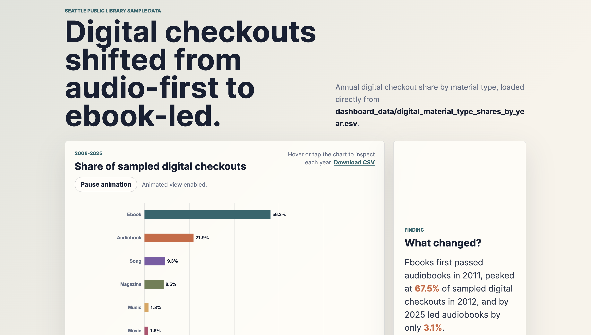
